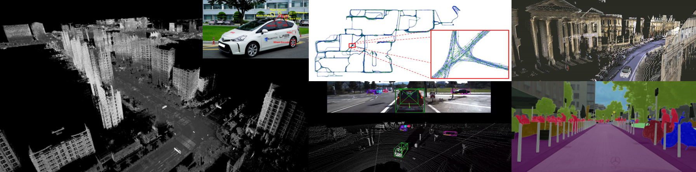

# Awesome SLAM Datasets 

>Thumbnail Figures from Complex Urban, NCLT, Oxford robotcar, KiTTi, Cityscapes datasets.  

This repository is the collection of SLAM-related datasets. Among various SLAM datasets, we've selected the datasets provide pose and map information. This repository is linked to the [google site](https://sites.google.com/view/awesome-slam-datasets/). In this repository, the overall dataset chart is represented as simplified version. You can use full version of the chart (made by google spreadsheet) in the [project page](https://sites.google.com/view/awesome-slam-datasets/).

We provide several category for each access of the data.

## News !! (Update: 2019-09-24)
- We add [FMDataset](https://github.com/zhuzunjie17/FastFusion) which consist on RGBD and IMU data for dense reconstruction of indoor environments
- In ICRA 2019 (Montreal), workshop on ['Dataset Generation and Benchmarking of SLAM Algorithms for Robotics and VR/AR'](https://sites.google.com/view/icra-2019-workshop/home) will be held!. We  are pretty sure that there will be many 'new' and 'hot' datasets intruduced at the workshop.
- We add [evaluation section](#evaluation) (Tools for trajectory and SLAM methods evaluation)
- We add a new UAV dataset, [UZH-FPV Drone Racing Dataset](http://rpg.ifi.uzh.ch/uzh-fpv.html), which aims high speed state estimation using RGB, Event, and IMU.
- [Complex Urban Dataset (KAIST)](http://irap.kaist.ac.kr/dataset/) now includes stereo camera images! (published in IJRR 2019)

## TODO
- Add datasets introduced in CVPR 2019
  - Waymo (https://waymo.com/open)
  - Nuscenes (https://www.nuscenes.org/)
  - ...
- Add Simulation datast category
  - CARLA
  - Airsim
  - Syncity

## Category
- [Evaluation](#evaluation)
  - Evaluation Methods of SLAM
- [Topic](#categorized-by-topic)
  - [Odometry](#odometry): Dataset for odometry Benchmark
  - [Mapping](#mapping): Dataset for mapping task
  - [Place Recognition](#place-recognition): Dataset gives correspondences of places (images)
  - [Localization](#localization): Dataset for metric-level localization
  - [Perception](#perception): Dataset with semantic labels / correspondences

- [Characteristics](#categorized-by-characteristics)
  - [Large-scale](#large-scale): City-scale map, kilometer level Map
  - [Long-term](#long-term): Multi-session, long-term data collection
  - [Map Complexity](#map-complexity): Variation of mapping structures
  - [Extreme Condition](#extreme-condition): Extreme environment, motions

- [Platform](#categorized-by-platform)
    - [Vehicle (Veh)](#vehicle): Commercial Vehicle (Four-wheeled on the road)
    - [Mobile robot (Mob)](#mobile-robot): Mobile Robots (Ex. Husky, Rover.. )
    - [Unmanned Aerial Vehicle (UAV)](#unmanned-aerial-vehicle): Unmanned aerial robots include drone.
    - [Autonomous Underwater Vehicle (AUV)](#autonomous-underwater-vehicle): Underwater robots include ROV for simplicity.
    - [Unmanned Surface Vehicle (USV)](#unmanned-surface-vehicle): Water surface vehicle such as canoe and boat.
    - [Hand-held Device (Hand)](#hand-held-device): Hand-held platform by human

- [Environment](#categorized-by-platform)
    - [Urban](#urban): City, campus, town, and infrastructures
    - [Indoor](#indoor): Indoor environment
    - [Terrain](#terrain): Rough terrain, underground, lake and farm
    - [Underwater](#underwater): Underwater floor, cave

## Overall datasets chart (Simplified Version)
[Link to Full version](https://sites.google.com/view/awesome-slam-datasets/)

| Shortname                                                                                                | Affiliation  | Year | Platform   | Publication | Environment           | GT-Pose | GT-Map | IMU | GPS | Labels | Lidar      | Cameras | RGBD | Event | Radar | Sonar | DVL | Other                   |
|----------------------------------------------------------------------------------------------------------|--------------|------|------------|-------------|-----------------------|---------|--------|-----|-----|--------|------------|---------|------|-------|-------|-------|-----|-------------------------|
| [UZH-FPV Drone Racing](http://rpg.ifi.uzh.ch/uzh-fpv.html)               | UZH, ETH       | 2019 | UAV       | ICRA  | Indoor, Urban                | O       |       | O   |     |        |            |  O     |     | O     |       |       |     |  |
| [FMDataset](https://github.com/zhuzunjie17/FastFusion)   | Hangzhou Dianzi / Tsinghua | 2019 | Hand | ICME | Indoor |   |   | O |   |   |   |   | O  |   |   |  |   |   |
| [Rosario Dataset](http://www.cifasis-conicet.gov.ar/robot/doku.php) | CONICET-UNR      | 2019 | Mob  | IJRR | Terrain    | O |   | O |   |   |   | O |   |   |   |   |   | Encoder                                  |
| [Collaborative SLAM Dataset (CSD)](https://github.com/torrvision/CollaborativeSLAMDataset)               | Oxford       | 2018 | Hand       | TVCG/ISMAR  | Indoor                | O       | O      | O   |     |        |            | O       | O    |       |       |       |     | Tango (Asus ZenFone AR)
| [ADVIO Dataset](https://github.com/AaltoVision/ADVIO)               | Aalto U          | 2018 | Hand | ECCV                | Urban      | O | O | O |   |   |   | O |   |   |   |   |   | iPhone, Tango, Pixel                     |
| [DeepIO Dataset](http://deepio.cs.ox.ac.uk/)                        | Oxford           | 2018 | Hand | Arxiv               | Indoor     | O |   | O |   |   |   |   |   |   |   |   |   |                                          |
| [Aqualoc Dataset](http://www.lirmm.fr/aqualoc/)                     | ONERA-DTIS       | 2018 | ROV  | IROS WS             | Underwater | O |   | O |   |   |   | O |   |   |   |   |   | Pressure Sensor                          |
| [InteriorNet](https://interiornet.org/)                             | Imperial College | 2018 | Hand | BMVC                | Indoor     | O | O | O |   | O |   | O | O | O |   |   |   | Texture, Lighting, Context, Optical Flow |
| [SPO Dataset](https://www.hs-karlsruhe.de/odometry-data/)           | TUM, Karlsruhe   | 2018 | Hand | Arxiv               | Urban      | O |   |   |   |   |   | O |   |   |   |   |   | Plenoptic Camera                         |
| [Complex Urban](http://irap.kaist.ac.kr/dataset/)                                                        | KAIST-IRAP   | 2018 | Veh        | ICRA        | Urban                 | O       | O      | O   | O   |        | O          |         |      |       |       |       |     | Encoder                 |
| [KAIST Day/Night](https://sites.google.com/view/multispectral/home)                                      | KAIST-RCV    | 2018 | Veh        | T-ITS       | Urban                 | O       |        | O   | O   | O      | O          | O       |      |       |       |       |     | Thermal Camera          |
| [TUM-Visual-Inertial](https://vision.in.tum.de/data/datasets/visual-inertial-dataset)                    | TUM          | 2018 | Hand       | Arxiv       | Indoor, Urban         |         |        | O   |     |        |            |         | O    |       | O     |       |     |                         |
| [Multi Vech Event](https://daniilidis-group.github.io/mvsec/)                                            | Upenn        | 2018 | Veh        | RA-L        | Urban                 | O       |        | O   | O   |        | O          | O       |      | O     |       |       |     |                         |
| [VI Canoe](https://databank.illinois.edu/datasets/IDB-9342111)                                           | UIUC         | 2018 | USV        | IJRR        | Terrain               | O       |        | O   | O   |        |            | O       |      |       |       |       |     |                         |
| [MPO-Japan](http://robotics.ait.kyushu-u.ac.jp/kurazume_lab/research-e.php?content=db)                   | ETH-RPG      | 2017 | UAV / Hand | IJRR        | Indoor                | O       |        | O   |     |        |            | O       |      | O     |       |       |     |                         |
| [Underwater Cave](http://cirs.udg.edu/caves-dataset/)                                                    | UDG          | 2017 | AUV        | IJRR        | Underwater            | O       |        | O   |     |        |            | O       |      |       |       | O     | O   | Profiling Sonar         |
| [Robot @ Home](http://mapir.isa.uma.es/mapirwebsite/index.php/mapir-downloads/203-robot-at-home-dataset) | MRPT         | 2017 | Mob        | IJRR        | Indoor                | O       | O      |     |     | O      | O          |         | O    |       |       |       |     | Semantic Labels         |
| [Zurich Urban MAV](http://rpg.ifi.uzh.ch/zurichmavdataset.html)                                          | ETH-RPG      | 2017 | UAV        | IJRR        | Urban                 | O       |        | O   | O   |        |            | O       |      |       |       |       |     | Streetview images       |
| [Chilean Underground](http://dataset.amtc.cl/#)                                                          | Trimble      | 2017 | Mob        | IJRR        | Terrain (Underground) | O       |        |     |     |        | O          | O       |      |       | O     |       |     | Encoder                 |
| [SceneNet RGB-D](https://robotvault.bitbucket.io/scenenet-rgbd.html)                                     | Imperial     | 2017 | Hand       | ICCV        | Indoor                | O       |        |     |     | O      |            |         | O    |       |       |       |     |                         |
| [Symphony Lake](http://dream.georgiatech-metz.fr/?q=node/79)                                             | Georgia Tech | 2017 | USV        | IJRR        | Terrain (Lake)        |         |        | O   | O   |        | O          | O       |      |       |       |       |     | PTZ camera, Longterm    |
| [Agricultural robot](http://www.ipb.uni-bonn.de/data/sugarbeets2016/)                                    | Bonn         | 2017 | Mob        | IJRR        | Terrain               | O       |        |     | O   | O      | O          | O       | O    |       |       |       |     | Multispectral camera    |
| [Beach Rover](https://robotics.estec.esa.int/datasets/katwijk-beach-11-2015/)                            | TEC-MMA      | 2017 | Mob        |             | Terrain               | O       |        | O   | O   |        | O          | O       | O    |       |       |       |     | Encoder                 |
| [EuRoC](http://projects.asl.ethz.ch/datasets/doku.php?id=kmavvisualinertialdatasets)                     | ETH-ASL      | 2016 | UAV        | IJRR        | Indoor                | O       | O      | O   |     |        |            | O       |      |       |       |       |     |                         |
| [Cartographer](https://google-cartographer-ros.readthedocs.io/en/latest/data.html)                     | Google      | 2016 | Hand        | ICRA        | Indoor                |         |        | O   |     |        | O          | O       |      |       |       |       |     |                         |
| [TUM-Mono](https://vision.in.tum.de/data/datasets/mono-dataset)                                          | TUM          | 2016 | Hand       | Arxiv       | Indoor, Urban         |         |        |     |     |        |            |         |      |       | O     |       |     | Photometric Calibration |
| [Cityscape](https://www.cityscapes-dataset.com/)                                                         | Daimler AG   | 2016 | Veh        | CVPR        | Urban                 | O       |        |     | O   | O      |            | O       |      |       |       |       |     |                         |
| [Solar-UAV](http://projects.asl.ethz.ch/datasets/doku.php?id=fsr2015)                                    | ETHZ         | 2016 | UAV        | CVPR        | Terrain               | O       | O      | O   | O   |        | O          |         |      |       |       |       |     |                         |
| [CoRBS](http://corbs.dfki.uni-kl.de/?pagerd_tumlltzzf42zsv6de7b9)                                        | DFKI         | 2016 | Hand       | WACV        | Indoor                | O       | O      |     |     |        |            |         | O    |       |       |       |     |                         |
| [Oxford-robotcar](http://robotcar-dataset.robots.ox.ac.uk)                                               | Oxford       | 2016 | Veh        | IJRR        | Urban                 | O       |        | O   | O   |        | O          | O       |      |       |       |       |     |                         |
| [NCLT](http://robots.engin.umich.edu/nclt/)                                                              | UMich        | 2016 | Mob        | IJRR        | Urban                 | O       |        | O   | O   |        | O          |         |      |       |       |       |     | FOG                     |
| [RPG-event](http://rpg.ifi.uzh.ch/davis_data.html)                                                       | Kyushu U     | 2016 | Veh        | IROS        | Urban, Terrain        |         |        | O   | O   |        | O          | O       |      |       |       |       |     | FARO 3D                 |
| [CCSAD](http://aplicaciones.cimat.mx/Personal/jbhayet/ccsad-dataset)                                     | CIMAT        | 2015 | Veh        | CAIP        | Urban                 |         |        | O   | O   |        |            | O       |      |       |       |       |     |                         |
| [TUM-Omni](https://vision.in.tum.de/data/datasets/omni-lsdslam)                                          | TUM          | 2015 | Hand       | IROS        | Indoor, Urban         |         |        |     |     |        |            | O       |      |       |       |       |     |                         |
| [Augmented ICL-NUIM](http://redwood-data.org/indoor/index.html)                                          | Redwood      | 2015 | Hand       | CVPR        | Indoor                | O       | O      |     |     |        |            |         | O    |       |       |       |     |                         |
| [Cambridge Landmark](http://mi.eng.cam.ac.uk/projects/relocalisation/)                                   | Cambridge    | 2015 | Hand       | ICCV        | Urban                 | O       | O      |     |     |        |            | O       |      |       |       |       |     |                         |
| [ICL-NUIM](https://www.doc.ic.ac.uk/~ahanda/VaFRIC/iclnuim.html)                                         | Imperial     | 2014 | Hand       | ICRA        | Indoor                | O       | O      |     |     |        |            |         | O    |       |       |       |     |                         |
| [MRPT-Malaga](https://www.mrpt.org/robotics_datasets)                                                    | MRPT         | 2014 | Veh        | AR          | Urban                 |         |        | O   | O   |        | O          | O       |      |       |       |       |     |                         |
| [KITTI](http://www.cvlibs.net/datasets/kitti/index.php)                                                  | KIT          | 2013 | Veh        | IJRR        | Urban                 | O       |        | O   | O   | O      | O          | O       |      |       |       |       |     |                         |
| [Canadian Planetary](http://asrl.utias.utoronto.ca/datasets/3dmap/#Datasets)                             | UToronto     | 2013 | Mob        | IJRR        | Terrain               | O       |        | O   | O   |        | O (sensor) | O       |      |       |       |       |     |                         |
| [Microsoft 7 scenes](https://www.microsoft.com/en-us/research/project/rgb-d-dataset-7-scenes/)                               | Microsoft    | 2013 | Hand       | CVPR        | Indoor                | O       | O      |     |     |        |            | O       |      |       |       |       |     |                         |
| [SeqSLAM](https://ieeexplore.ieee.org/document/6224623)                              | QUT          | 2012 | Veh        | ICRA        | Urban                 |         |        |     |     | O      |            | O       |      |       |       |       |     |                         |
| [ETH-challenging](http://projects.asl.ethz.ch/datasets/doku.php?id=laserregistration:laserregistration)  | ETH-ASL      | 2012 | Hand       | IJRR        | Urban, Terrain        |         |        | O   | O   |        | O          | O       | O    |       |       |       |     |                         |
| [TUM-RGBD](https://vision.in.tum.de/data/datasets/rgbd-dataset)                                          | TUM          | 2012 | Hand / Mob | IROS        | Indoor                | O       |        | O   |     |        |            |         | O    |       |       |       |     |                         |
| [ASRL-Kagara-airborne](http://asrl.utias.utoronto.ca/~mdw/kagarudataset.html)                            | UToronto     | 2012 | UAV        | FSR         | Terrain               |         |        | O   | O   |        |            | O       |      |       |       |       |     |                         |
| [Devon Island Rover](http://asrl.utias.utoronto.ca/datasets/devon-island-rover-navigation/)              | UToronto     | 2012 | Mob        | IJRR        | Terrain               | O       |        |     | O   |        |            | O       |      |       |       |       |     | Sunsensor, Inclinometer |
| [ACFR Marine](http://marine.acfr.usyd.edu.au/datasets/)                                                  | ACFR         | 2012 | AUV        |             | Underwater            | O       |        | O   |     | O      |            | O       |      |       |       | O     |     |                         |
| [UTIAS Multi-Robot](http://asrl.utias.utoronto.ca/datasets/mrclam/)                                      | UT-IAS       | 2011 | Mob        | IJRR        | Urban                 | O       |        |     |     | O      |            |         |      |       |       |       |     |                         |
| [Ford Campus](http://robots.engin.umich.edu/SoftwareData/Ford)                                           | UMich        | 2011 | Veh        | IJRR        | Urban                 | O       |        | O   | O   |        | O          | O       |      |       |       |       |     |                         |
| [San francisco](https://sites.google.com/site/chenmodavid/datasets)                                      | Stanford     | 2011 | Veh        | CVPR        | Urban                 | O       |        | O   | O   | O      |            | O       |      |       |       |       |     | DMI                     |
| [Annotated-laser](https://journals.sagepub.com/doi/10.1177/0278364910389840)                                                       | NTU          | 2011 | Veh        | IJRR        | Urban                 | O       |        |     |     | O      | O          | O       |      |       |       |       |     |                         |
| [MIT-DARPA](http://grandchallenge.mit.edu/wiki/index.php?title=PublicData)                               | MIT          | 2010 | Veh        | IJRR        | Urban                 | O       |        | O   | O   | O      | O          | O       |      |       |       |       |     |                         |
| [St Lucia Stereo](http://asrl.utias.utoronto.ca/~mdw/uqstluciadataset.html)                              | UToronto     | 2010 | Veh        | ACRA        | Urban                 |         |        | O   | O   |        |            | O       |      |       |       |       |     |                         |
| [St Lucia Multiple Times](https://ieeexplore.ieee.org/abstract/document/5509547)          | QUT          | 2010 | Veh        | ICRA        | Urban                 |         |        |     | O   |        |            | O       |      |       |       |       |     |                         |
| [Marulan](http://sdi.acfr.usyd.edu.au/)                                                                  | ACFR         | 2010 | Mob        | IJRR        | Terrain               | O       |        | O   | O   |        | O          | O       |      |       | O     |       |     | IR                      |
| [COLD](https://www.nada.kth.se/cas/COLD/)                                                                   | KTH          | 2009 | Hand       | IJRR        | Indoor                | O       |        |     |     | O      | O          | O       |      |       |       |       |     |                         |
| [NewCollege](http://www.robots.ox.ac.uk/NewCollegeData/)                                                 | Oxford-Robot | 2009 | Mob        | IJRR        | Urban                 | O       |        |   O  | O   |        | O          | O       |      |       |       |       |     |                         |
| [Rawseeds-indoor](http://www.rawseeds.org/home/category/benchmarking-toolkit/datasets/)                  | Milano       | 2009 | Mob        | IROSW       | Indoor                | O       | O      | O   |     |        | O          | O       |      |       |       | O     |     |                         |
| [Rawseeds-outdoor](http://www.rawseeds.org/home/category/benchmarking-toolkit/datasets/)                 | Milano       | 2009 | Mob        | IROSW       | Urban                 | O       | O      | O   | O   |        | O          | O       |      |       |       | O     |     |                         |
| [FABMAP](http://www.robots.ox.ac.uk/~mobile/IJRR_2008_Dataset/)                                          | Oxford-Robot | 2008 | Veh        | IJRR        | Urban                 |         |        |     | O   |        |            | O       |      |       |       |       |     |                         |

## Evaluation
_Evaluation methods for SLAM benchmarks_
- Trajectory Evaluation with Alignment [[Paper](http://rpg.ifi.uzh.ch/docs/IROS18_Zhang.pdf)], [[Code](https://github.com/uzh-rpg/rpg_trajectory_evaluation)]
- Python package for the evaluation of odometry and SLAM [[Code](https://michaelgrupp.github.io/evo/)]
- SLAMBench2.0: SLAM performance evaluation framework [[Code](https://github.com/pamela-project/slambench2)]

## Categorized By Topic

### Odometry
_Dataset for odometry Benchmark_
- [UZH-FPV Drone Racing](http://rpg.ifi.uzh.ch/uzh-fpv.html)
- [TUM-Visual-Inertial](https://vision.in.tum.de/data/datasets/visual-inertial-dataset)
- [Visual-Inertial Canoe Dataset](https://databank.illinois.edu/datasets/IDB-9342111)
- [Multi Vehicle Stereo Event Camera Dataset](https://docs.google.com/spreadsheets/d/1mudM7LxXv09ywuQGDp3t_RlIjIdwzg_ZaMu78agLmH4/edit#gid=0)
- [Zurich Urban Micro Aerial Vehicle Dataset](http://rpg.ifi.uzh.ch/zurichmavdataset.html)
- [EuRoC MAV Dataset](https://projects.asl.ethz.ch/datasets/doku.php?id=kmavvisualinertialdatasets)
- [TUM Monocular Cameras Dataset](https://vision.in.tum.de/data/datasets/mono-dataset)
- [Event-Camera Dataset and Simulator](http://rpg.ifi.uzh.ch/davis_data.html)
- [TUM Omnidirectional Cameras Dataset](https://vision.in.tum.de/data/datasets/omni-lsdslam)
- [ICL-NUIM RGBD Dataset](https://www.doc.ic.ac.uk/~ahanda/VaFRIC/iclnuim.html)
- [TUM RGB-D SLAM Dataset and Benchmark](https://vision.in.tum.de/data/datasets/rgbd-dataset)
- [Google Cartographer](https://google-cartographer-ros.readthedocs.io/en/latest/data.html)
- [ADVIO Dataset](https://github.com/AaltoVision/ADVIO)
- [Deep Inertial Odometry Dataset](http://deepio.cs.ox.ac.uk/)
- [Aqualoc Underwater Dataset](http://www.lirmm.fr/aqualoc/)
- [Rosario Agricultural Dataset](http://www.cifasis-conicet.gov.ar/robot/doku.php)
- [Stereo Plenoptic Odometry Dataset](https://www.hs-karlsruhe.de/odometry-data/)

### Mapping
_Dataset for mapping task_
- [Collaborative SLAM Dataset (CSD)](https://github.com/torrvision/CollaborativeSLAMDataset)
- [Complex Urban](http://irap.kaist.ac.kr/dataset/)
- [Multi-modal Panoramic 3D Outdoor Dataset (MPO)](http://robotics.ait.kyushu-u.ac.jp/kurazume_lab/research-e.php?content=db)
- [Underwater Caves SONAR and Vision Dataset](http://cirs.udg.edu/caves-dataset/)
- [Chilean Underground Mine Dataset](http://dataset.amtc.cl/#)
- [Oxford Robotcar Dataset](http://robotcar-dataset.robots.ox.ac.uk/)
- [University of Michigan North Campus Long-Term (NCLT) Vision and LIDAR Dataset](http://robots.engin.umich.edu/nclt/)
- [Málaga Stereo and Laser Urban Data Set](https://www.mrpt.org/MalagaUrbanDataset)
- [KITTI Vision Benchmark Suite](http://www.cvlibs.net/datasets/kitti/index.php)
- [Challenging data sets for point cloud registration algorithms](https://projects.asl.ethz.ch/datasets/doku.php?id=laserregistration:laserregistration)
- [ACFR Marine Robotics Dataset](http://marine.acfr.usyd.edu.au/datasets/)
- [Ford Campus Vision and Lidar Dataset](http://robots.engin.umich.edu/SoftwareData/Ford)
- [InteriorNet](https://interiornet.org/)
- [FMDataset](https://github.com/zhuzunjie17/FastFusion)

### Place Recognition
_Dataset gives correspondences of places (images)_
- [Visual-Inertial Canoe Dataset](https://databank.illinois.edu/datasets/IDB-9342111)
- [Symphony Lake Dataset](http://dream.georgiatech-metz.fr/?q=node/79)
- [Alderley Day/Night Dataset](https://wiki.qut.edu.au/pages/viewpage.action?pageId=181178395)
- [St Lucia Multiple Times of Day](https://wiki.qut.edu.au/display/cyphy/St+Lucia+Multiple+Times+of+Day)
- [New College Vision and Laser Data Set](http://www.robots.ox.ac.uk/NewCollegeData/)
- [FABMAP Dataset](http://www.robots.ox.ac.uk/~mobile/IJRR_2008_Dataset/)

### Localization
_Dataset for metric-level localization_
- [Cambridge Landmark Dataset](http://mi.eng.cam.ac.uk/projects/relocalisation/)
- [KITTI Vision Benchmark Suite](http://www.cvlibs.net/datasets/kitti/index.php)
- [Microsoft 7 scenes](https://www.microsoft.com/en-us/research/project/rgb-d-dataset-7-scenes/)
- [San Francisco Landmark Dataset](https://sites.google.com/site/chenmodavid/datasets)

### Perception
_Dataset with semantic labels / correspondences_
- [KAIST Day/Night Dataset](https://sites.google.com/view/multispectral/home)
- [Robot @ Home Dataset](http://mapir.isa.uma.es/mapirwebsite/index.php/mapir-downloads/203-robot-at-home-dataset)
- [SceneNet RBG-D Dataset](https://robotvault.bitbucket.io/scenenet-rgbd.html)
- [Sugar Beets 2016, Agricultural Robot Dataset](http://www.ipb.uni-bonn.de/data/sugarbeets2016/)
- [CityScapes Dataset](https://www.cityscapes-dataset.com/)
- [KITTI Vision Benchmark Suite](http://www.cvlibs.net/datasets/kitti/index.php)
- [Multi-Sensor Perception (Marulan) Dataset ](http://sdi.acfr.usyd.edu.au/)
- [InteriorNet](https://interiornet.org/)

## Categorized By Characteristics

### Large-scale
_City-scale map, kilometer level Map_
- [Complex Urban](http://irap.kaist.ac.kr/dataset/)
- [Multi Vehicle Stereo Event Camera Dataset](https://docs.google.com/spreadsheets/d/1mudM7LxXv09ywuQGDp3t_RlIjIdwzg_ZaMu78agLmH4/edit#gid=0)
- [Multi-modal Panoramic 3D Outdoor Dataset (MPO)](http://robotics.ait.kyushu-u.ac.jp/kurazume_lab/research-e.php?content=db)
- [CityScapes Dataset](https://www.cityscapes-dataset.com/)
- [Solar-powered UAV Sensing and Mapping Dataset](https://projects.asl.ethz.ch/datasets/doku.php?id=fsr2015)
- [Oxford Robotcar Dataset](http://robotcar-dataset.robots.ox.ac.uk/)
- [CCSAD (Stereo Urban) Dattaset](http://aplicaciones.cimat.mx/Personal/jbhayet/ccsad-dataset)
- [Málaga Stereo and Laser Urban Data Set](https://www.mrpt.org/MalagaUrbanDataset)
- [KITTI Vision Benchmark Suite](http://www.cvlibs.net/datasets/kitti/index.php)
- [Kagaru Airborne Stereo Dataset Dataset](http://asrl.utias.utoronto.ca/~mdw/kagarudataset.html)
- [ACFR Marine Robotics Dataset](http://marine.acfr.usyd.edu.au/datasets/)

### Long-term
_Multi-session, long-term data collection_
- [KAIST Day/Night Dataset](https://sites.google.com/view/multispectral/home)
- [Visual-Inertial Canoe Dataset](https://databank.illinois.edu/datasets/IDB-9342111)
- [Symphony Lake Dataset](http://dream.georgiatech-metz.fr/?q=node/79)
- [Oxford Robotcar Dataset](http://robotcar-dataset.robots.ox.ac.uk/)
- [University of Michigan North Campus Long-Term (NCLT) Vision and LIDAR Dataset](http://robots.engin.umich.edu/nclt/)
- [Alderley Day/Night Dataset](https://wiki.qut.edu.au/pages/viewpage.action?pageId=181178395)
- [St Lucia Multiple Times of Day](https://wiki.qut.edu.au/display/cyphy/St+Lucia+Multiple+Times+of+Day)

### Map Complexity
_Variation of mapping structures_
- [Complex Urban](http://irap.kaist.ac.kr/dataset/)
- [Multi Vehicle Stereo Event Camera Dataset](https://docs.google.com/spreadsheets/d/1mudM7LxXv09ywuQGDp3t_RlIjIdwzg_ZaMu78agLmH4/edit#gid=0)
- [Multi-modal Panoramic 3D Outdoor Dataset (MPO)](http://robotics.ait.kyushu-u.ac.jp/kurazume_lab/research-e.php?content=db)
- [Málaga Stereo and Laser Urban Data Set](https://www.mrpt.org/MalagaUrbanDataset)
- [KITTI Vision Benchmark Suite](http://www.cvlibs.net/datasets/kitti/index.php)
- [Challenging data sets for point cloud registration - algorithms](https://projects.asl.ethz.ch/datasets/doku.php?id=laserregistration:laserregistration)

### Extreme Condition
_Extreme environment, motions_
- [UZH-FPV Drone Racing](http://rpg.ifi.uzh.ch/uzh-fpv.html)
- [Underwater Caves SONAR and Vision Dataset](http://cirs.udg.edu/caves-dataset/): Underwater Environment
- [Chilean Underground Mine Dataset](http://dataset.amtc.cl/#): Underground Environment
- [CityScapes Dataset](https://www.cityscapes-dataset.com/): Foggy Scene
- [EuRoC MAV Dataset](https://projects.asl.ethz.ch/datasets/doku.php?id=kmavvisualinertialdatasets): Fast motion
- [Multi-Sensor Perception (Marulan) Dataset ](http://sdi.acfr.usyd.edu.au/):  Smoky, dust, and Rain condition

## Categorized by Platform

### Vehicle
_Commercial Vehicle (Four-wheeled on the road)_
- [Complex Urban Dataset](http://irap.kaist.ac.kr/dataset/)
- [Multi Vehicle Stereo Event Camera Dataset](https://docs.google.com/spreadsheets/d/1mudM7LxXv09ywuQGDp3t_RlIjIdwzg_ZaMu78agLmH4/edit#gid=0)
- [KAIST Day/Night Dataset](https://sites.google.com/view/multispectral/home)
- [Multi-modal Panoramic 3D Outdoor Dataset (MPO)](http://robotics.ait.kyushu-u.ac.jp/kurazume_lab/research-e.php?content=db)
- [Oxford Robotcar Dataset](http://robotcar-dataset.robots.ox.ac.uk/)
- [CityScapes Dataset](https://www.cityscapes-dataset.com/)
- [CCSAD (Stereo Urban) Dattaset](http://aplicaciones.cimat.mx/Personal/jbhayet/ccsad-dataset)
- [Málaga Stereo and Laser Urban Data Set](https://www.mrpt.org/MalagaUrbanDataset)
- [KITTI Vision Benchmark Suite](http://www.cvlibs.net/datasets/kitti/index.php)
- [Day and Night with Lateral Pose Change Dataset](https://wiki.qut.edu.au/display/cyphy/Day+and+Night+with+Lateral+Pose+Change+Datasets)
- [Alderley Day/Night Dataset](https://wiki.qut.edu.au/pages/viewpage.action?pageId=181178395)
- [Annotated-laser Dataset](http://any.csie.ntu.edu.tw/data) (Link Broken)
- [San Francisco Landmark Dataset](https://sites.google.com/site/chenmodavid/datasets)
- [Ford Campus Vision and Lidar Dataset](http://robots.engin.umich.edu/SoftwareData/Ford)
- [St Lucia Stereo Vehicular Dataset](http://asrl.utias.utoronto.ca/~mdw/uqstluciadataset.html)
- [St Lucia Multiple Times of Day](https://wiki.qut.edu.au/display/cyphy/St+Lucia+Multiple+Times+of+Day)
- [MIT DARPA Urban Challenge Dataset](http://grandchallenge.mit.edu/wiki/index.php?title=PublicData)
- [FABMAP Dataset](http://www.robots.ox.ac.uk/~mobile/IJRR_2008_Dataset/)

### Mobile Robot
_Mobile Robots (Ex. Husky, Rover.. )_
- [Rosario Dataset](http://www.cifasis-conicet.gov.ar/robot/doku.php)
- [Sugar Beets 2016, Agricultural Robot Dataset](http://www.ipb.uni-bonn.de/data/sugarbeets2016/)
- [Chilean Underground Mine Dataset](http://dataset.amtc.cl/#)
- [Katwijk Beach Planetary Rover Dataset](https://robotics.estec.esa.int/datasets/katwijk-beach-11-2015/)
- [Robot @ Home Dataset](http://mapir.isa.uma.es/mapirwebsite/index.php/mapir-downloads/203-robot-at-home-dataset)
- [University of Michigan North Campus Long-Term (NCLT) Vision and LIDAR Dataset](http://robots.engin.umich.edu/nclt/)
- [Rawseeds In/Outdoor Dataset](http://www.rawseeds.org/home/category/benchmarking-toolkit/datasets/)
- [Canadian Planetary Emulation Terrain 3D Mapping Dataset](http://asrl.utias.utoronto.ca/datasets/3dmap/#Datasets)
- [Devon Island Rover Navigation Dataset](http://asrl.utias.utoronto.ca/datasets/devon-island-rover-navigation/)
- [Multi-Robot Cooperative Localization and Mapping Dataset](http://asrl.utias.utoronto.ca/datasets/mrclam/)
- [Multi-Sensor Perception (Marulan) Dataset ](http://sdi.acfr.usyd.edu.au/)
- [TUM RGB-D SLAM Dataset and Benchmark](https://vision.in.tum.de/data/datasets/rgbd-dataset)
- [New College Vision and Laser Data Set](http://www.robots.ox.ac.uk/NewCollegeData/)

### Unmanned Aerial Vehicle
_Unmanned aerial robots include drone_
- [UZH-FPV Drone Racing](http://rpg.ifi.uzh.ch/uzh-fpv.html)
- [Zurich Urban Micro Aerial Vehicle Dataset](http://rpg.ifi.uzh.ch/zurichmavdataset.html)
- [Event-Camera Dataset and Simulator](http://rpg.ifi.uzh.ch/davis_data.html)
- [Solar-powered UAV Sensing and Mapping Dataset](https://projects.asl.ethz.ch/datasets/doku.php?id=fsr2015)
- [EuRoC MAV Dataset](https://projects.asl.ethz.ch/datasets/doku.php?id=kmavvisualinertialdatasets)
- [Kagaru Airborne Stereo Dataset Dataset](http://asrl.utias.utoronto.ca/~mdw/kagarudataset.html)

### Autonomous Underwater Vehicle
_Underwater robots include ROV for simplicity_
- [Aqualoc Underwater Dataset](http://www.lirmm.fr/aqualoc/)
- [Underwater Caves SONAR and Vision Dataset](http://cirs.udg.edu/caves-dataset/)
- [ACFR Marine Robotics Dataset](http://marine.acfr.usyd.edu.au/datasets/)

### Unmanned Surface Vehicle
_Water surface vehicle such as canoe and boat_
- [Visual-Inertial Canoe Dataset](https://databank.illinois.edu/datasets/IDB-9342111)
- [Symphony Lake Dataset](http://dream.georgiatech-metz.fr/?q=node/79)

### Hand-held Device
_Hand-held platform by human_
- [Collaborative SLAM Dataset (CSD)](https://github.com/torrvision/CollaborativeSLAMDataset)
- [SceneNet RBG-D Dataset](https://robotvault.bitbucket.io/scenenet-rgbd.html)
- [Event-Camera Dataset and Simulator](http://rpg.ifi.uzh.ch/davis_data.html)
- [Comprehensive RGB-D Benchmark (CoRBS)](http://corbs.dfki.uni-kl.de/?pagerd_tumlltzzf42zsv6de7b9)
- [Augmented ICL-NUIM Reconstruction Dataset](http://redwood-data.org/indoor/index.html)
- [ICL-NUIM RGBD Dataset](https://www.doc.ic.ac.uk/~ahanda/VaFRIC/iclnuim.html)
- [Challenging data sets for point cloud registration algorithms](https://projects.asl.ethz.ch/datasets/doku.php?id=laserregistration:laserregistration)
- [Cosy Localization Database (COLD)](https://www.pronobis.pro/#data)
- [ADVIO Dataset](https://github.com/AaltoVision/ADVIO)
- [Deep Inertial Odometry Dataset](http://deepio.cs.ox.ac.uk/)
- [InteriorNet](https://interiornet.org/)
- [Stereo Plenoptic Dataset](https://www.hs-karlsruhe.de/odometry-data/)
- [FMDataset](https://github.com/zhuzunjie17/FastFusion)

## Categorized by Environment
### Urban
_City, campus, town, and infrastructures_
- [UZH-FPV Drone Racing](http://rpg.ifi.uzh.ch/uzh-fpv.html)
- [ADVIO Dataset](https://github.com/AaltoVision/ADVIO)
- [Stereo Plenoptic Dataset](https://www.hs-karlsruhe.de/odometry-data/)
- [KAIST Day/Night Dataset](https://sites.google.com/view/multispectral/home)
- [TUM-Visual-Inertial](https://vision.in.tum.de/data/datasets/visual-inertial-dataset)
- [Complex Urban](http://irap.kaist.ac.kr/dataset/)
- [Multi Vehicle Stereo Event Camera Dataset](https://docs.google.com/spreadsheets/d/1mudM7LxXv09ywuQGDp3t_RlIjIdwzg_ZaMu78agLmH4/edit#gid=0)
- [Zurich Urban Micro Aerial Vehicle Dataset](http://rpg.ifi.uzh.ch/zurichmavdataset.html)
- [TUM Monocular Cameras Dataset](https://vision.in.tum.de/data/datasets/mono-dataset)
- [CityScapes Dataset](https://www.cityscapes-dataset.com/)
- [Oxford Robotcar Dataset](http://robotcar-dataset.robots.ox.ac.uk/)
- [University of Michigan North Campus Long-Term (NCLT) Vision and LIDAR Dataset](http://robots.engin.umich.edu/nclt/)
- [Event-Camera Dataset and Simulator](http://rpg.ifi.uzh.ch/davis_data.html)
- [CCSAD (Stereo Urban) Dattaset](http://aplicaciones.cimat.mx/Personal/jbhayet/ccsad-dataset)
- [TUM Omnidirectional Cameras Dataset](https://vision.in.tum.de/data/datasets/omni-lsdslam)
- [Cambridge Landmark Dataset](http://mi.eng.cam.ac.uk/projects/relocalisation/)
- [Málaga Stereo and Laser Urban Data Set](https://www.mrpt.org/MalagaUrbanDataset)
- [KITTI Vision Benchmark Suite](http://www.cvlibs.net/datasets/kitti/index.php)
- [Alderley Day/Night Dataset](https://wiki.qut.edu.au/pages/viewpage.action?pageId=181178395)
- [Challenging data sets for point cloud registration algorithms](https://projects.asl.ethz.ch/datasets/doku.php?id=laserregistration:laserregistration)
- [Multi-Robot Cooperative Localization and Mapping Dataset](http://asrl.utias.utoronto.ca/datasets/mrclam/)
- [Ford Campus Vision and Lidar Dataset](http://robots.engin.umich.edu/SoftwareData/Ford)
- [San Francisco Landmark Dataset](https://sites.google.com/site/chenmodavid/datasets)
- [Annotated-laser Dataset](http://any.csie.ntu.edu.tw/data) (Link Broken)
- [MIT DARPA Urban Challenge Dataset](http://grandchallenge.mit.edu/wiki/index.php?title=PublicData)
- [St Lucia Stereo Vehicular Dataset](http://asrl.utias.utoronto.ca/~mdw/uqstluciadataset.html)
- [St Lucia Multiple Times of Day](https://wiki.qut.edu.au/display/cyphy/St+Lucia+Multiple+Times+of+Day)
- [New College Vision and Laser Data Set](http://www.robots.ox.ac.uk/NewCollegeData/)
- [Rawseeds In/Outdoor Dataset](http://www.rawseeds.org/home/category/benchmarking-toolkit/datasets/)
- [FABMAP Dataset](http://www.robots.ox.ac.uk/~mobile/IJRR_2008_Dataset/)

### Indoor
_Indoor environment_
- [FMDataset](https://github.com/zhuzunjie17/FastFusion)
- [UZH-FPV Drone Racing](http://rpg.ifi.uzh.ch/uzh-fpv.html)
- [Collaborative SLAM Dataset (CSD)](https://github.com/torrvision/CollaborativeSLAMDataset)
- [InteriorNet](https://interiornet.org/)
- [TUM-Visual-Inertial](https://vision.in.tum.de/data/datasets/visual-inertial-dataset)
- [Multi-modal Panoramic 3D Outdoor Dataset (MPO)](http://robotics.ait.kyushu-u.ac.jp/kurazume_lab/research-e.php?content=db)
- [Robot @ Home Dataset](http://mapir.isa.uma.es/mapirwebsite/index.php/mapir-downloads/203-robot-at-home-dataset)
- [SceneNet RBG-D Dataset](https://robotvault.bitbucket.io/scenenet-rgbd.html)
- [EuRoC MAV Dataset](https://projects.asl.ethz.ch/datasets/doku.php?id=kmavvisualinertialdatasets)
- [TUM Monocular Cameras Dataset](https://vision.in.tum.de/data/datasets/mono-dataset)
- [Comprehensive RGB-D Benchmark (CoRBS)](http://corbs.dfki.uni-kl.de/?pagerd_tumlltzzf42zsv6de7b9)
- [TUM Omnidirectional Cameras Dataset](https://vision.in.tum.de/data/datasets/omni-lsdslam)
- [Augmented ICL-NUIM Reconstruction Dataset](http://redwood-data.org/indoor/index.html)
- [ICL-NUIM RGBD Dataset](https://www.doc.ic.ac.uk/~ahanda/VaFRIC/iclnuim.html)
- [Microsoft 7 scenes](https://www.microsoft.com/en-us/research/project/rgb-d-dataset-7-scenes/)
- [TUM RGB-D SLAM Dataset and Benchmark](https://vision.in.tum.de/data/datasets/rgbd-dataset)
- [Cosy Localization Database (COLD)](https://www.pronobis.pro/#data)
- [Rawseeds In/Outdoor Dataset](http://www.rawseeds.org/home/category/benchmarking-toolkit/datasets/)
- [Google Cartographer](https://google-cartographer-ros.readthedocs.io/en/latest/data.html)

### Terrain
_Rough terrain, underground, lake and farm_
- [Rosario Agricultural Dataset](http://www.cifasis-conicet.gov.ar/robot/doku.php)
- [Visual-Inertial Canoe Dataset](https://databank.illinois.edu/datasets/IDB-9342111)
- [Chilean Underground Mine Dataset](http://dataset.amtc.cl/#)
- [Symphony Lake Dataset](http://dream.georgiatech-metz.fr/?q=node/79)
- [Sugar Beets 2016, Agricultural Robot Dataset](http://www.ipb.uni-bonn.de/data/sugarbeets2016/)
- [Katwijk Beach Planetary Rover Dataset](https://robotics.estec.esa.int/datasets/katwijk-beach-11-2015/)
- [Solar-powered UAV Sensing and Mapping Dataset](https://projects.asl.ethz.ch/datasets/doku.php?id=fsr2015)
- [Event-Camera Dataset and Simulator](http://rpg.ifi.uzh.ch/davis_data.html)
- [Canadian Planetary Emulation Terrain 3D Mapping Dataset](http://asrl.utias.utoronto.ca/datasets/3dmap/#Datasets)
- [Challenging data sets for point cloud registration - algorithms](https://projects.asl.ethz.ch/datasets/doku.php?id=laserregistration:laserregistration)
- [Kagaru Airborne Stereo Dataset Dataset](http://asrl.utias.utoronto.ca/~mdw/kagarudataset.html)
- [Devon Island Rover Navigation Dataset](http://asrl.utias.utoronto.ca/datasets/devon-island-rover-navigation/)
- [Multi-Sensor Perception (Marulan) Dataset ](http://sdi.acfr.usyd.edu.au/)

### Underwater
_Underwater floor, cave_
- [Aqualoc Underwater Dataset](http://www.lirmm.fr/aqualoc/)
- [Underwater Caves SONAR and Vision Dataset](http://cirs.udg.edu/caves-dataset/)
- [ACFR Marine Robotics Dataset](http://marine.acfr.usyd.edu.au/datasets/)

## Contributing
Please Feel free to send a [pull request](https://github.com/youngguncho/awesome-slam-datasets/pulls) to modify the list or add datasets.

## License

To the extent possible under law, [Younggun Cho](https://github.com/youngguncho) has waived all copyright and related or neighboring rights to this work.
